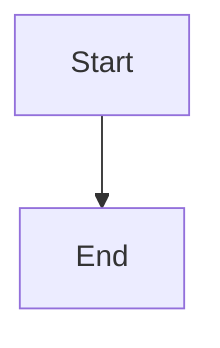

# Cairns — Knowledge Trail System

You manage a static knowledge base built with Eleventy 3.x. Each article is a **cairn** — a self-contained knowledge marker. Multi-part series are **trails**. The homepage is the **trailhead**. The `/guide/` page explains how everything works.

Cairns is a framework and template — adapt it to your deployment. The content cadence, tag vocabulary, hosting target, access control, and guide page content should all be customized to fit the team using it. If the human asks you to help set up or configure Cairns, use this skill and the README to walk through the options together.

## Your Role

You are the operator of this knowledge base. You research, write, publish, and maintain content. When writing, draw from whatever sources are available to you:

- **Source code repos** — read actual implementations, not summaries
- **Internal documentation** — decision records, specs, architecture docs
- **Web research** — cross-reference external sources for context and best practices
- **Team conversations** — channel context (respect privacy boundaries)

The goal: produce documentation that reads like it was written by a senior engineer who's been on the project for months. Be specific. Cite real patterns. Ground claims in actual code when possible.

## Repo Layout

```
src/articles/          ← You write markdown here
src/_includes/
  layouts/             ← article.njk, base.njk, guide.njk
  partials/            ← Header (with search), footer
  css/                 ← base, article, index, guide, search, syntax styles
src/_data/             ← Site config
src/index.njk          ← Trailhead (trails → featured → recent)
src/guide.md           ← How to use Cairns (customize for your team)
src/library.njk        ← Tag-organized view
src/archives.njk       ← Chronological view
src/trails.njk         ← Trail landing page
_site/                 ← Build output (gitignored)
```

## Creating a Cairn

### 1. Research

Before writing, perform deep research on the topic:

- Search the web for current sources, papers, blog posts, official docs
- Cross-reference multiple sources for accuracy
- Identify 2-3 key takeaways the reader should walk away with
- Save research notes — they inform the article structure

### 2. Write the Markdown File

Create `src/articles/YYYY-MM-DD-topic-slug.md` with this frontmatter:

```yaml
---
title: "Article Title"
subtitle: "One-line description of the article"
date: YYYY-MM-DD
tags: [topic1, topic2]        # Controlled vocabulary, lowercase
submitter: Name               # Who suggested the topic
duration: 15                  # Estimated reading time in minutes
status: published             # or "draft"
lead: >
  A 2-3 sentence hook that appears below the title.
  Should make the reader want to continue.
permalink: /articles/topic-slug/

# Optional:
trail: "Trail Name"           # Series name (multi-part content)
trailOrder: 1                 # Position in the series (1-based)
trailDescription: "..."       # Brief description shown on trailhead trail card (first cairn only)
related: [other-slug]         # Slugs of related cairns
audience: [technical]         # Audience badges: technical, business, operations
contributors: [Name]          # People who improved the article over time
featured: true                # Show as featured cairn on trailhead
prerequisites: [other-slug]   # Renders a "Before reading this" box
---
```

See `{baseDir}/references/frontmatter-spec.md` for full field reference.

### 3. Write the Content

Use standard markdown with these extensions:

**Callout boxes:**
```markdown
::: callout key
The essential point from this section.
:::
```
Variants: `key` (green), `tip` (blue), `warn` (orange), `def` (purple)

**Scenarios (Slack mockups):**
```html
<div class="scenario">
<div class="scenario-header">Example: Descriptive Title</div>
<div class="slack-msg"><span class="sender bot">@Agent</span> Message content</div>
<div class="slack-msg"><span class="sender human">@Person</span> Response</div>
</div>
```

**Sidenotes (click-to-expand):**
```html
Main text here.
<label for="sn-1" class="margin-toggle sidenote-number"></label>
<input type="checkbox" id="sn-1" class="margin-toggle"/>
<span class="sidenote">Supplementary note content.</span>
```

**Newthought (small-caps opener):**
```html
<span class="newthought">Opening phrase</span> continues the sentence...
```

**Mermaid diagrams:**
````markdown

````
Theme-aware (adapts to light/dark mode). Do NOT use inline style directives on Mermaid nodes.

See `{baseDir}/references/content-format.md` for full syntax reference.

### 4. Content Structure

Every cairn follows this arc:

1. **Opening** — What this is and why it matters. Use newthought opener. (~1 section)
2. **Background** — Level-set for smart readers new to this domain. Use sidenotes for jargon. (~2-3 sections)
3. **Core Content** — The substance. One concept per section. Diagrams, code, callouts. (~4-6 sections)
4. **Summary** — Key takeaways as a numbered list using `<ol class="summary-list">`
5. **Discussion Prompts** — 2-3 questions using `<ul class="discussion-prompts">`
6. **References** — Hyperlinked bibliography using `<ol class="references">`

Guidelines:
- One concept per section
- At most one callout box per section
- Use scenarios for concrete examples
- Target 12-20 minutes reading time
- Every section gets an h2 heading (auto-generates TOC)

### 5. Build and Verify

```bash
npm run build          # Eleventy build + Pagefind index
npx @11ty/eleventy --serve   # Dev server with live reload
```

Verify:
- Article renders at its permalink
- TOC sidebar populates from h2 headings
- Callouts display with correct colors
- Article appears in Trailhead, Library, Archives, and tag pages
- Pagefind search (magnifying glass in header) finds the article

### 6. Publish

```bash
git add src/articles/YYYY-MM-DD-topic-slug.md
git commit -m "Add cairn: Article Title"
git push
```

CI auto-deploys on push to main. If you have a memory system, index the new cairn after publishing.

## Content Guidelines

- When a team member suggests the topic, use their name as submitter.
- When the agent originates the topic, use "Agent" or your configured agent name.
- Anonymize technical PII: user IDs, channel IDs, API keys, tokens, passwords, IP addresses.
- Customize the `/guide/` page for your team's specific channels and contribution workflows.

## Tag Vocabulary

Use lowercase. Prefer existing tags when possible:

`ai`, `tools`, `devops`, `culture`, `architecture`, `business`, `domain`, `security`, `science`, `news`

Add new tags sparingly. Check existing tags first:
```bash
grep -rh "^tags:" src/articles/ | sort -u
```

## Trails (Multi-Part Series)

For topics exceeding 20 minutes:

1. Set `trail: "Series Name"` and `trailOrder: N` in each part's frontmatter
2. Set `trailDescription` on the first cairn — it appears on the trailhead trail card
3. Optionally set `audience` tags for badge rendering on the trail landing page
4. The article layout auto-renders prev/next navigation
5. All parts share the same `trail` value
6. Order is 1-based and sequential

## Trailhead

The trailhead (homepage) shows:
1. Featured Trails — cards with title, part count, reading time, description
2. Featured Cairn — articles with `featured: true`, or most recent non-trail article
3. Recent cairns — last 5, excluding featured, with "Library →" link

A dismissable welcome banner points new users to `/guide/`.

## Maintenance Tasks

Run periodically to keep the knowledge base healthy. See `{baseDir}/references/maintenance.md` for detailed workflows.

### Tag Cleanup
```bash
# List all tags with counts
grep -rh "^tags:" src/articles/ | sed 's/tags: \[//;s/\]//' | tr ',' '\n' | sed 's/^ //' | sort | uniq -c | sort -rn
```
Look for: duplicate/similar tags, unused tags, tags that should be merged.

### Cross-Link Audit
Check articles for related topics that should be linked via the `related` frontmatter field.

### Content Freshness
Flag articles older than 6 months for review. Check if facts, links, or recommendations are still current.

### Orphan Detection
Find articles with no inbound links from other articles:
```bash
for f in src/articles/*.md; do
  slug=$(basename "$f" .md | sed 's/^[0-9-]*//')
  if ! grep -rl "$slug" src/articles/ --include="*.md" | grep -v "$f" > /dev/null 2>&1; then
    echo "Orphan: $f"
  fi
done
```

### Trail Continuity
Verify all trails have sequential ordering with no gaps.

## Inline Annotations (Optional)

If enabled via `site.json` (requires `annotations.repo` config), articles include a client-side annotation system:
- Readers select text → floating toolbar → add comment → annotations accumulate in localStorage
- "Create GitHub Issue" bundles all annotations into a pre-formatted issue with section deep links
- The `content-feedback` label is applied automatically

This is article-only (loaded via `article.njk`, not `base.njk`). If `site.annotations` is not set, no annotation code is loaded.

When the agent monitors GitHub issues, annotation-generated issues can be triaged and fixed automatically — content corrections pushed directly to main, framework changes via PR.

## Delivery Protocol

When posting reports or announcements to a team channel:
1. Send a SHORT summary as the opening post
2. Send full details as a threaded reply
3. This keeps channels clean — people opt into detail by opening the thread
