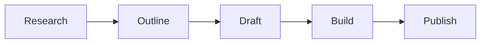

# Content Format Reference

The article body is standard markdown with `html: true` enabled. Use these extensions for rich content.

## Callout Boxes

Fenced container syntax via markdown-it-container:

```markdown
::: callout key
The essential point from this section.
:::
```

### Variants

| Type | Color | Use For |
|------|-------|---------|
| `key` | Green | Key takeaways — the thing the reader must remember |
| `tip` | Blue | Implementation tips, practical advice |
| `warn` | Orange | Warnings, caveats, things that can go wrong |
| `def` | Purple | Definitions, terminology explanations |

### Rules
- At most one callout per section
- Keep callout text to 1-3 sentences
- Callouts support markdown inside (bold, links, code)

## Scenario Blocks (Slack Mockups)

Use raw HTML for precise control:

```html
<div class="scenario">
<div class="scenario-header">Example: Descriptive Title</div>
<div class="slack-msg"><span class="sender bot">@AgentName</span> Bot message content here.</div>
<div class="slack-msg"><span class="sender human">@PersonName</span> Human message here.</div>
</div>
```

### Sender Types
- `bot` — purple text, for agent/bot messages
- `human` — blue text, for human messages

### Formatting Inside Messages
- Use `<strong>` for bold
- Use `<code>` for inline code
- Use `<br/>` for line breaks
- Use `<em>` for italics

## Sidenotes

Click-to-expand supplementary notes. Use sequential IDs (sn-1, sn-2, etc.):

```html
Main text continues here.
<label for="sn-1" class="margin-toggle sidenote-number"></label>
<input type="checkbox" id="sn-1" class="margin-toggle"/>
<span class="sidenote">The supplementary note content. Can include
links, emphasis, and other inline formatting.</span>
```

### Rules
- Number sidenotes sequentially within the article (sn-1, sn-2, sn-3...)
- Keep sidenotes to 1-3 sentences
- Use for definitions, historical context, "did you know", source notes
- The main text must be complete without sidenotes

## Newthought Opener

Small-caps opening phrase for key paragraphs (Tufte style):

```html
<span class="newthought">Opening phrase here</span> and the sentence continues normally.
```

Use at the start of major sections (typically the first paragraph under each h2).

## Summary List

Numbered items with purple circle indicators:

```html
<ol class="summary-list">
<li><strong>Point title</strong> — brief explanation.</li>
<li><strong>Point title</strong> — brief explanation.</li>
</ol>
```

## Discussion Prompts

Questions with speech bubble icons:

```html
<ul class="discussion-prompts">
<li>First question for team discussion?</li>
<li>Second question exploring implications?</li>
<li>Third question about application to our context?</li>
</ul>
```

Aim for 2-3 prompts. Make them specific and actionable, not generic.

## References

Annotated bibliography:

```html
<ol class="references">
<li><a href="URL">Source Title</a> <span class="annotation">— Brief description of what this source covers and why it's relevant.</span></li>
</ol>
```

### Rules
- Include 4-8 references per cairn
- Every reference gets an annotation (1 sentence)
- Prefer primary sources over aggregator summaries
- Verify links are accessible

## Mermaid Diagrams

Use fenced code blocks with the `mermaid` language hint. They render as interactive SVG diagrams with theme-aware colors.

````markdown

````

### Supported Diagram Types

- `graph` / `flowchart` — process flows, decision trees
- `sequenceDiagram` — interaction sequences between actors
- `classDiagram` — entity relationships
- `stateDiagram-v2` — state machines
- `gantt` — timelines and schedules
- `pie` — proportional data
- `mindmap` — topic hierarchies

### Guidelines

- Keep diagrams focused — one concept per diagram
- Use short, clear node labels
- Prefer `graph LR` (left-to-right) for process flows, `graph TD` (top-down) for hierarchies
- Diagrams auto-adapt to dark/light mode — no manual color overrides needed
- Test complex diagrams with `npm run serve` before publishing

## Standard Markdown

All standard markdown works: headings, bold, italic, lists, links, code blocks, images, blockquotes, horizontal rules, tables.

### Headings
- `## H2` — main section headings (auto-generate TOC entries)
- `### H3` — subsection headings within a section
- Do not use H1 (set by the layout from frontmatter title)
- Do not skip levels (no H4 directly under H2)

### Code Blocks
Fenced code blocks with language hints:

````markdown
```python
def example():
    return "highlighted"
```
````

### Images
```markdown

```
Store images in the article's directory or a shared assets folder.
