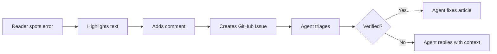
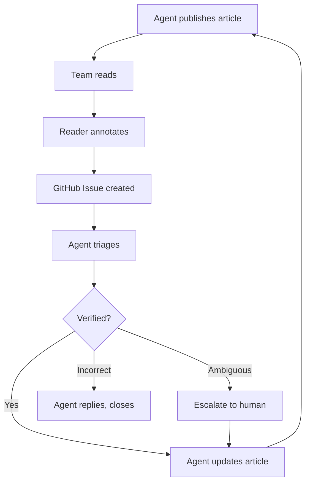

## Why Feedback Matters More Than Publishing

<span class="newthought">Most knowledge bases die</span> not because they lack content, but because they lack a correction mechanism. Someone notices an article is wrong — outdated API, changed process, incorrect claim — and there's no low-friction way to say so. They mention it in Slack, maybe. The author is busy. The article stays wrong. Trust erodes.
<label for="sn-1" class="margin-toggle sidenote-number"></label>
<input type="checkbox" id="sn-1" class="margin-toggle"/>
<span class="sidenote">This is the core failure mode of wikis: the effort to correct is high (find the page, edit, save, hope you don't break formatting), the reward is invisible, and the original author may never know it happened.</span>

Cairns addresses this with a two-part strategy: an inline annotation system that makes feedback effortless for readers, and an agent workflow that makes corrections fast for the maintainer.



::: callout key

The goal is **zero friction for the reader** and **zero manual triage for the maintainer.** The reader highlights, comments, and submits. The agent verifies against source systems, makes the correction, and closes the issue — or replies with context if the original was actually right.

:::

## How Inline Annotations Work

<span class="newthought">The annotation system is opt-in</span> — it loads only when `annotations.repo` is configured in `src/_data/site.json`. When enabled, every article gets an unobtrusive annotation layer with no extra UI visible until the reader takes action.

### The Reader Experience

1. **Select text** — highlight any passage in the article body
2. **Click "Add Note"** — a floating toolbar appears near the selection
3. **Write a comment** — "This API was deprecated in v3" or "The diagram shows the old architecture"
4. **Repeat** — annotations accumulate in a tray at the bottom of the page, stored in localStorage
5. **Submit** — click "Create Issue" to bundle all annotations into a single, well-formatted GitHub Issue

The result is a GitHub Issue that looks like this:

<div class="scenario">
<div class="scenario-header">Example: Auto-generated feedback issue</div>
<div class="slack-msg"><span class="sender bot">GitHub Issue #42</span> <strong>Feedback: API Versioning Without the Grief</strong><br/><br/>
<strong>Annotation 1</strong><br/>
> "URL-path versioning feels natural until you have thirty endpoints"<br/>
<strong>Section:</strong> <a href="#">The Problem with URL Paths</a><br/>
We switched to header-based versioning in March. This section needs updating.<br/><br/>
<strong>Annotation 2</strong><br/>
> "The migration path from v1 to v2 is straightforward"<br/>
<strong>Section:</strong> <a href="#">Migration Strategy</a><br/>
Not straightforward anymore — requires a client-side SDK update since the auth changes.<br/><br/>
<em>Label: content-feedback</em></div>
</div>

Each annotation includes the selected text (as a blockquote), the section heading (as a deep link), and the reader's comment. The `content-feedback` label is applied automatically so the agent can filter for these issues.

### Configuration

Enabling annotations requires two fields in `src/_data/site.json`:

```json
{
  "title": "Cairns",
  "description": "Agent-powered knowledge trail system",
  "url": "https://your-cairns-site.example.com",
  "annotations": {
    "repo": "your-org/your-cairns-repo"
  }
}
```

That's it. The annotation CSS and JavaScript load conditionally — when `site.annotations` is not set, zero annotation code is included in the build. No extra dependencies, no external services, no database.
<label for="sn-2" class="margin-toggle sidenote-number"></label>
<input type="checkbox" id="sn-2" class="margin-toggle"/>
<span class="sidenote">Annotations are stored in localStorage, scoped to the article's permalink. They persist across page reloads but are private to the reader's browser until explicitly submitted as a GitHub Issue. No data is sent anywhere until the reader clicks "Create Issue."</span>

::: callout tip

For public repos where you don't want anonymous issue creation, leave `annotations` unconfigured. Readers can still provide feedback through normal GitHub Issues or whatever channel your team prefers. The annotation system is most valuable for internal deployments where readers have repo access.

:::

## The Agent Triage Workflow

<span class="newthought">Feedback without triage is just noise.</span> The annotation system is designed to pair with an agent that monitors the `content-feedback` label on GitHub Issues and processes them autonomously.

### What the Agent Does

When a `content-feedback` issue appears:

1. **Parse the annotations** — extract the selected text, section anchors, and comments
2. **Verify against sources** — check the claim against the actual codebase, docs, or external systems the article references
3. **Decide the action:**
   - **Correction confirmed** — update the article, commit, close the issue with a diff link
   - **Already accurate** — reply with evidence, close as "not applicable"
   - **Needs human judgment** — add a comment with findings, assign a reviewer

<div class="scenario">
<div class="scenario-header">Example: Agent triages a feedback issue</div>
<div class="slack-msg"><span class="sender bot">@CairnsAgent</span> Triaged Issue #42: "Feedback: API Versioning Without the Grief"<br/><br/>
<strong>Annotation 1</strong> — Confirmed. <code>api-gateway/config.yaml</code> shows <code>Accept-Version</code> header routing added 2026-03-15. Updated section "The Problem with URL Paths" → "Header-Based Versioning."<br/><br/>
<strong>Annotation 2</strong> — Confirmed. The SDK changelog shows auth changes in v2.3.0 that affect the migration path. Updated section "Migration Strategy" with the new steps.<br/><br/>
Committed: <a href="#">a1b2c3d</a> · Closed #42</div>
</div>

The key insight is that the agent doesn't just trust the feedback — it **verifies** against the same sources it used to write the article. This prevents well-meaning but incorrect corrections from degrading content quality.

::: callout warn

The agent should never auto-close issues it can't verify. If the referenced source isn't accessible or the claim is ambiguous, it should escalate to a human. A wrong "fix" is worse than a pending issue.

:::

### Scheduling Triage

The triage workflow can run on different triggers:

| Trigger | Use Case |
|---------|----------|
| **Cron (daily)** | Batch-process overnight feedback |
| **Webhook** | React to issues in near-real-time |
| **Manual** | Agent checks when asked |
| **On publish** | Check for open feedback before releasing new content |

For most teams, a daily cron is sufficient. The agent queries for open issues with the `content-feedback` label, processes them in order, and reports a summary to the team channel.

## The Full Correction Cycle

<span class="newthought">Putting it all together,</span> the feedback loop creates a continuous improvement cycle:



This cycle means articles get better over time without anyone owning a "documentation review" process. The readers are the reviewers. The agent is the editor. The GitHub Issue is the paper trail.

### What Makes This Different

Traditional feedback mechanisms (wiki edit buttons, Google Docs comments, Slack threads) share a common failure: they put the burden of making the correction on the person who noticed the problem. Cairns inverts this:

<ol class="summary-list">
<li><strong>Reader effort is minimal</strong> — highlight, comment, submit. No editing, no formatting, no finding the right file.</li>
<li><strong>Context is preserved</strong> — the exact text, the section anchor, and the reader's interpretation travel together in a structured format.</li>
<li><strong>Verification is automatic</strong> — the agent checks claims against sources before making changes, preventing well-intentioned but wrong corrections.</li>
<li><strong>The paper trail is built-in</strong> — every correction is a GitHub Issue with a commit link. Auditable, searchable, attributable.</li>
</ol>

::: callout key

The feedback loop transforms readers from passive consumers into active contributors — without asking them to learn a content management system, find the right file, or make a pull request. The annotation system meets them where they already are: reading the article.

:::

## Discussion Prompts

<ul class="discussion-prompts">
<li>What's the current path for someone on your team to correct a wrong piece of documentation? How many steps does it take?</li>
<li>Would your team be more likely to give feedback through inline annotations or through a Slack command like "@agent this article is wrong about X"?</li>
<li>How important is verification before auto-correction? Are there domains where you'd want human review for every change?</li>
</ul>

## References & Further Reading

<ol class="references">
<li><a href="https://docs.github.com/en/issues">GitHub Issues</a> <span class="annotation">— The underlying mechanism for annotation submission. Issues support labels, assignees, and deep linking.</span></li>
<li><a href="https://developer.mozilla.org/en-US/docs/Web/API/Window/localStorage">localStorage API</a> <span class="annotation">— Client-side storage used for annotations. Private to the reader's browser, no server required.</span></li>
<li><a href="https://developer.mozilla.org/en-US/docs/Web/API/Selection">Selection API</a> <span class="annotation">— The browser API that powers text selection and range extraction for the annotation toolbar.</span></li>
<li><a href="https://www.11ty.dev/docs/data-cascade/">Eleventy Data Cascade</a> <span class="annotation">— How site.json configuration flows into templates, enabling conditional annotation loading.</span></li>
</ol>
