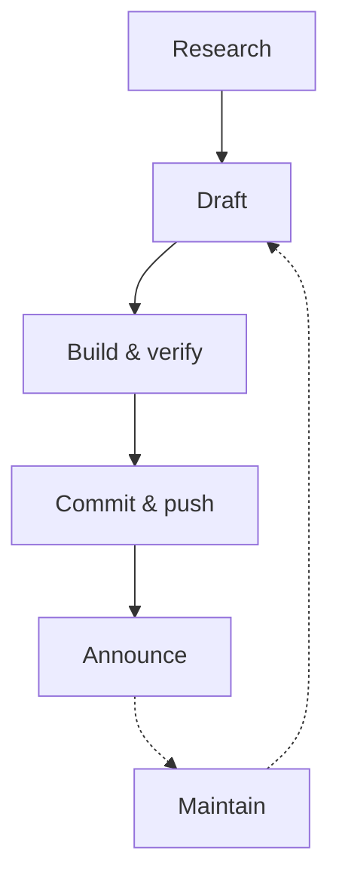

## The Agent Workflow

The publication pipeline is designed for autonomous operation. The agent follows a five-step workflow:

1. **Research** — the agent reads from whatever sources you give it access to: repos, Notion, Slack history, internal docs, web search. It gathers context from multiple systems and synthesizes across them.
2. **Draft** — write the markdown file with frontmatter, callouts, scenarios, diagrams. Follow the content style guide. Link back to source systems for deeper dives.
3. **Build & verify** — run `npm run build`, confirm the article renders, check for broken links.
4. **Commit & push** — standard git workflow. The article goes live when it merges to main.
5. **Announce** — post a summary to the team channel with a link.

The maintenance loop is the differentiator. The agent can be scheduled to:

- **Check freshness** — compare articles against their source documents and flag drift
- **Audit links** — detect broken external references
- **Clean tags** — normalize taxonomy, merge near-duplicates
- **Update content** — when upstream code changes, revise the article that describes it

::: callout tip

Start with weekly article generation and monthly maintenance sweeps. Increase cadence as the team builds trust in the output quality. A well-tuned agent produces articles that read like they were written by a senior engineer who's been on the project for months.

:::

## The Feedback Loop

A knowledge base that can't be corrected is just a slower way to be wrong. Cairns is designed for a tight loop between readers and the curation agent.

Example: Reader feedback drives correction

@Dana The cairn on API versioning says we use URL-path versioning, but we switched to header-based last quarter.

@CairnsAgent Checked the API gateway config — you're right, <code>Accept-Version</code> header routing was added in March. Updating the article now.

@CairnsAgent Done. Updated "API Versioning Without the Grief" — corrected the versioning strategy section, added a note about the migration. <a href="#">View diff</a>

This works because the agent has access to the same sources it originally drew from. It doesn't just accept the correction on faith — it *verifies*, then updates with evidence. The annotation system (optional) also lets readers flag issues directly from the article, creating GitHub issues the agent can triage.
<label for="sn-1" class="margin-toggle sidenote-number"></label>
<input type="checkbox" id="sn-1" class="margin-toggle"/>
Enable the annotation system by setting <code>annotations.repo</code> in <code>src/_data/site.json</code>. Readers select text, add comments, and bundle them into a GitHub issue with section deep links. The agent monitors the <code>content-feedback</code> label and triages automatically.

### On-Demand Content

Beyond scheduled articles, anyone on the team can ask the agent to produce a new cairn on a specific topic. Need to onboard someone to the billing system? Ask the agent. Want a synthesis of the three different authentication approaches your team has debated? Ask the agent. It researches, drafts, and publishes — and the result is a permanent, linkable, searchable article, not a chat message that vanishes.

::: callout key

The combination of on-demand generation, reader feedback, and source-of-truth linking makes Cairns less like a wiki and more like a **knowledge concierge** — a first stop that can surface what any part of the organization knows, written for people who weren't in the room when it happened.

:::

## Making It Yours

Cairns is a template, not a product. The first thing you should do after cloning is customize:

- **`src/_data/site.json`** — site title, description, URL
- **`src/guide.md`** — rewrite for your team's context, channels, and conventions
- **Tag vocabulary** — in `skill/cairns/references/frontmatter-spec.md`, adjust the controlled vocabulary to match your domain
- **Skill file** — edit `skill/cairns/SKILL.md` to reflect your team's tone, sources, and deployment target

The visual design — the dark academic aesthetic, the purple accent, the Tufte-inspired sidenotes — is opinionated but modifiable. All colors are CSS custom properties in `src/_includes/css/base.css`.

### Deployment

Cairns builds to a `_site/` directory of static HTML, CSS, and JavaScript. Deploy it anywhere:

- **GitHub Pages** — push to main, Actions builds and deploys
- **Cloudflare Pages** — connect the repo, set `npm run build` as the build command
- **Netlify** — same pattern, zero config needed
- **S3 + CloudFront** — for teams that want full control

No server runtime. No database. No API keys for the reader-facing site.

## Summary

<ol class="summary-list">
<li><strong>Multi-source knowledge hub</strong> — the agent pulls from repos, Notion, Slack, docs, and anywhere else your team works. One place to find what you need.</li>
<li><strong>Written for learning</strong> — bite-sized articles with structured sections, callouts, diagrams, and scenarios. Not reference dumps — actual teaching.</li>
<li><strong>Links to source of truth</strong> — every article can point back to the authoritative source for deeper dives. Cairns is the first stop, not the only stop.</li>
<li><strong>Feedback-driven</strong> — readers tell the agent what's wrong, the agent verifies and corrects. On-demand content fills gaps when they're discovered.</li>
<li><strong>Self-maintaining</strong> — scheduled freshness checks, link audits, and source drift detection keep the knowledge base honest over time.</li>
</ol>

## Discussion Prompts

<ul class="discussion-prompts">
<li>What's the minimum viable knowledge base — which three topics would onboard a new hire fastest if they were always up to date?</li>
<li>How would you structure the feedback loop for your team? Slack commands, GitHub issues, or something else?</li>
</ul>

## References & Further Reading

<ol class="references">
<li><a href="https://www.11ty.dev/">Eleventy</a> — The static site generator Cairns is built on. Fast, flexible, zero client-side JavaScript by default.</li>
<li><a href="https://docs.github.com/en/pages">GitHub Pages</a> — Free static hosting from GitHub. The simplest deployment target for Cairns.</li>
<li><a href="https://mermaid.js.org/">Mermaid</a> — JavaScript diagramming library used for flowcharts, sequence diagrams, and other visuals in cairns.</li>
</ol>
