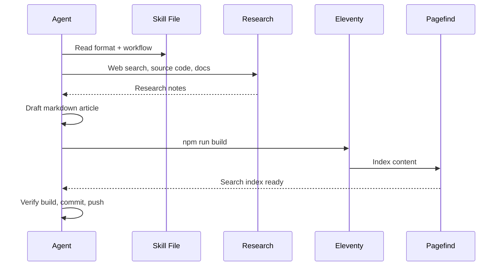

## Callout Boxes

<span class="newthought">Cairns provides four color-coded callout variants</span> for different purposes. Each is written with a simple markdown fence — the build system handles the rest.

::: callout key

**Key takeaways** use green. Reserve these for the single most important insight from a section — the thing the reader should remember if they forget everything else.

:::

::: callout tip

**Tips** use blue. Practical advice, implementation guidance, shortcuts. The kind of thing a senior engineer mentions offhand that saves you two hours.

:::

::: callout warn

**Warnings** use orange. Gotchas, caveats, things that will bite you if you're not careful. Use sparingly — if everything is a warning, nothing is.

:::

::: callout def

**Definitions** use purple. Terminology, jargon, concepts that need grounding. Especially valuable when writing for a mixed audience of technical and non-technical readers.

:::

## Scenario Blocks

<span class="newthought">Scenario blocks simulate Slack conversations.</span> They're useful for showing how a process or tool interaction actually *feels* in practice, not just how it works in theory.

<div class="scenario">
<div class="scenario-header">Example: Agent publishes a new cairn</div>
<div class="slack-msg"><span class="sender bot">@CairnsAgent</span> Published: <strong>"What Is Cairns?"</strong><br/>A guide to the knowledge trail system and how to make it yours.<br/><code>12 min read · tools, ai, culture, architecture</code></div>
<div class="slack-msg"><span class="sender human">@Dana</span> Nice. Can you add a section on how trails work with an example from our onboarding series?</div>
<div class="slack-msg"><span class="sender bot">@CairnsAgent</span> Done — added a trail example to the "Content Model" section using the Security Fundamentals trail. Rebuilt and pushed. <a href="#">View diff</a></div>
</div>

Scenario blocks are raw HTML with `.scenario`, `.slack-msg`, and `.sender` classes. The sender type (`bot` or `human`) controls the name color — purple for agents, blue for people.

## Mermaid Diagrams

<span class="newthought">Fenced code blocks with the `mermaid` language hint</span> render as SVG diagrams. They auto-adapt to dark and light mode and re-render on theme toggle.



Mermaid supports flowcharts, sequence diagrams, class diagrams, state machines, Gantt charts, pie charts, and mindmaps. Keep diagrams focused — one concept per diagram, short node labels, and never use inline style directives (they break the theme system).

## Sidenotes

<span class="newthought">Sidenotes are click-to-expand supplementary notes</span> — asides, historical context, source attributions — that don't interrupt the main flow.
<label for="sn-1" class="margin-toggle sidenote-number"></label>
<input type="checkbox" id="sn-1" class="margin-toggle"/>
<span class="sidenote">The sidenote pattern is borrowed from Edward Tufte's book design. Tufte argues that sidenotes are superior to footnotes because they keep supplementary information at the point of relevance rather than banishing it to the bottom of the page.</span>

The main text should always be complete without them. They're dessert, not the meal. Use them for definitions, historical context, "did you know" asides, and source notes.
<label for="sn-2" class="margin-toggle sidenote-number"></label>
<input type="checkbox" id="sn-2" class="margin-toggle"/>
<span class="sidenote">The color palette was chosen for extended reading comfort. The dark mode uses a deep blue-black (#0c0c14) rather than pure black, which reduces eye strain. The purple accent (#7c5cfc) provides visual interest without the harshness of a saturated blue or green.</span>

## Syntax-Highlighted Code

<span class="newthought">Standard fenced code blocks</span> with language hints render with Prism.js syntax highlighting:

```python
def publish_cairn(article_path: str) -> None:
    """Build the site and verify the new article appears."""
    frontmatter = parse_frontmatter(article_path)
    validate_required_fields(frontmatter)

    # Build and index
    subprocess.run(["npm", "run", "build"], check=True)

    # Verify the article rendered
    slug = frontmatter["permalink"].strip("/").split("/")[-1]
    output = Path(f"_site/articles/{slug}/index.html")
    assert output.exists(), f"Article did not render: {output}"
```

## Tables

<span class="newthought">Standard markdown tables render</span> with striped rows and hover highlighting:

| Component | Syntax | Purpose |
|-----------|--------|---------|
| Callout | `::: callout key\|tip\|warn\|def` | Highlight key information |
| Scenario | HTML with `.scenario` class | Slack conversation mockups |
| Sidenote | HTML with checkbox toggle | Supplementary context |
| Mermaid | ` ```mermaid ` code fence | Diagrams and flowcharts |
| Newthought | `<span class="newthought">` | Small-caps section openers |
| Summary list | `<ol class="summary-list">` | Numbered key points |

::: callout tip

Every component is written in standard markdown or simple HTML. Your agent doesn't need any special tooling — just the content format reference in `skill/cairns/references/content-format.md`.

:::

## Discussion Prompts

<ul class="discussion-prompts">
<li>Which components would be most useful for the kind of content your team needs? Are there patterns missing?</li>
<li>How important is visual consistency across articles? Does the one-callout-per-section rule feel right?</li>
</ul>

## References & Further Reading

<ol class="references">
<li><a href="https://mermaid.js.org/">Mermaid</a> <span class="annotation">— JavaScript diagramming library used for flowcharts, sequence diagrams, and other visuals in cairns.</span></li>
<li><a href="https://edwardtufte.github.io/tufte-css/">Tufte CSS</a> <span class="annotation">— The design inspiration for Cairns' sidenotes and typography.</span></li>
<li><a href="https://prismjs.com/">Prism.js</a> <span class="annotation">— Syntax highlighting library. Cairns uses build-time highlighting via markdown-it-prism.</span></li>
</ol>
