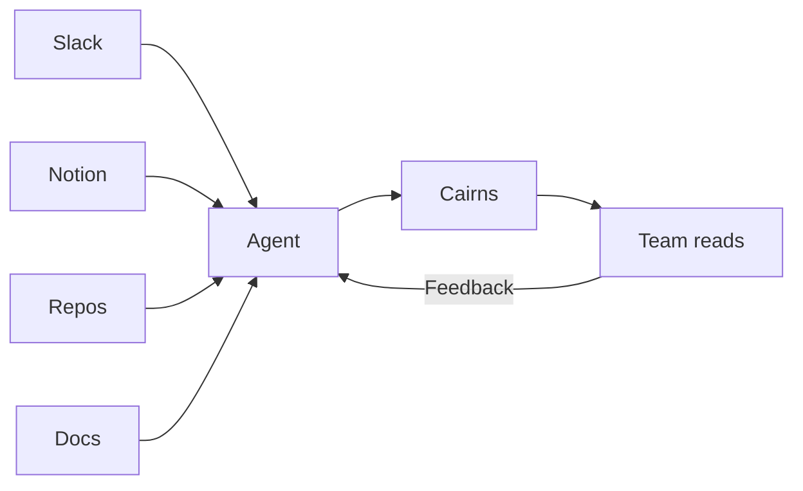

## The Problem Cairns Solves

<span class="newthought">Every team generates more knowledge</span> than it captures — and what it does capture gets scattered everywhere. A decision lands in a Slack thread. The implementation detail lives in a repo README. The business context is in a Notion page. The rationale is in someone's head.
<label for="sn-1" class="margin-toggle sidenote-number"></label>
<input type="checkbox" id="sn-1" class="margin-toggle"/>
<span class="sidenote">The term "cairn" comes from the Scottish Gaelic <em>càrn</em> — a stack of stones left on a trail to mark the way for those who follow. Hikers have used them for thousands of years.</span>

Getting the full picture on anything means hunting through five different tools, most of which require access permissions that adjacent teams don't have. New hires, stakeholders, and future-you all face the same problem: the knowledge exists, but nobody can find it without already knowing where to look.



::: callout key

The core insight: **an AI agent can do the synthesis.** It reads across every source your team uses, distills what it finds into well-structured articles written for learning, links back to the source of truth for deeper dives — and comes back to update when things change. Humans review, discuss, and steer. The agent does the labor.

:::

## How It Works

<span class="newthought">Cairns is a static site</span> built with [Eleventy](https://www.11ty.dev/). Articles are markdown files with YAML frontmatter. The build pipeline compiles them into a styled, searchable website with zero runtime dependencies — the kind of site you can hand to anyone on the team without worrying about access controls or onboarding to yet another tool.

The architecture is deliberately simple:

| Layer | Technology | Purpose |
|-------|-----------|---------|
| Sources | Repos, Notion, Slack, docs | Agent reads from these |
| Content | Markdown + frontmatter | Agent writes here |
| Build | Eleventy 3.x | Compiles to static HTML |
| Search | Pagefind | Build-time full-text index |
| Styling | Custom CSS | Dark/light mode, responsive |
| Agent | OpenClaw skill | Teaches the format + workflow |

The agent learns the content format from a **skill file** — a structured markdown document that describes the article template, frontmatter fields, markdown extensions, and publication workflow. Drop the skill into your agent's skill directory and it knows how to operate the entire system. Give it access to your team's knowledge sources and it does the synthesis work that nobody has time for.

::: callout def

**Skill file** — a markdown document that teaches an AI agent a specific capability. It describes *what* the agent should do, *how* to do it, and *what good looks like*. In Cairns, the skill file at `skill/cairns/SKILL.md` contains the complete operating manual for the knowledge base.

:::

## The Content Model

<span class="newthought">Cairns organizes knowledge</span> around three concepts:

<ol class="summary-list">
<li><strong>Cairn</strong> — a single article. Self-contained, well-researched, 12–20 minutes reading time. Each cairn has a title, subtitle, tags, reading time estimate, and a lead paragraph that hooks the reader.</li>
<li><strong>Trail</strong> — a multi-part series. Linked cairns with automatic prev/next navigation, shared metadata, and a collective reading time. Use trails for deep dives that span multiple sessions.</li>
<li><strong>Trailhead</strong> — the homepage. Shows active trails, the featured cairn, and recent articles. It's the starting point for readers who want to browse.</li>
</ol>

Every article lives in `src/articles/` as a dated markdown file. The frontmatter drives everything: tags auto-generate topic pages, trails auto-link their parts, and the featured flag controls the homepage hero card.

### Frontmatter in Practice

Here's what a typical article header looks like:

```yaml
---
title: "Zero-Trust for Small Teams"
subtitle: "The enterprise playbook doesn't work. Here's what does."
date: 2026-04-01
tags: [security, architecture]
submitter: Dana
duration: 18
status: published
lead: >
  You've heard the buzzword. You've seen the vendor slides.
  Here's what it actually looks like with six people
  and a budget of "we have AWS credits."
permalink: /articles/zero-trust-small-teams/
trail: "Security Fundamentals"
trailOrder: 1
audience: [technical]
---
```

## Discussion Prompts

<ul class="discussion-prompts">
<li>What knowledge do people outside your team's core tools struggle to access? What would change if it were surfaced in one readable place?</li>
<li>If you could ask an agent to synthesize any topic from your team's scattered sources right now, what would you ask for first?</li>
</ul>

## References & Further Reading

<ol class="references">
<li><a href="https://www.11ty.dev/">Eleventy</a> <span class="annotation">— The static site generator Cairns is built on. Fast, flexible, zero client-side JavaScript by default.</span></li>
<li><a href="https://pagefind.app/">Pagefind</a> <span class="annotation">— Build-time search indexing for static sites. Powers Cairns' full-text search with no runtime dependencies.</span></li>
<li><a href="https://edwardtufte.github.io/tufte-css/">Tufte CSS</a> <span class="annotation">— The design inspiration for Cairns' sidenotes and typography. Tufte's principles of minimal, information-dense design.</span></li>
</ol>
