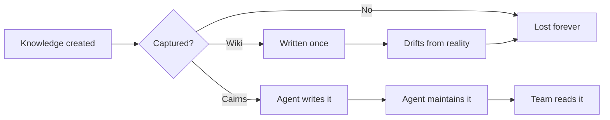
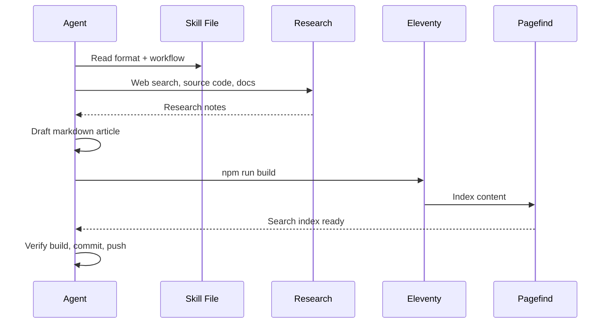
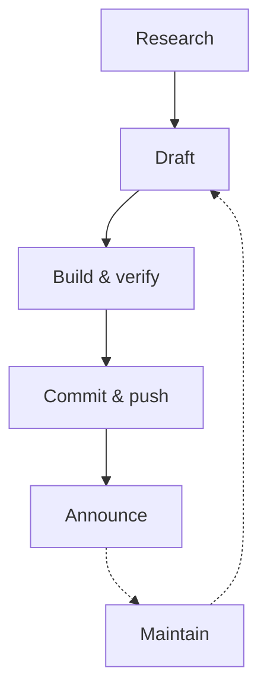

## The Problem Cairns Solves

<span class="newthought">Every team generates more knowledge</span> than it captures. Decisions happen in meetings. Patterns emerge in code review. Hard-won lessons live in someone's head until they leave, and then they're gone.
<label for="sn-1" class="margin-toggle sidenote-number"></label>
<input type="checkbox" id="sn-1" class="margin-toggle"/>
<span class="sidenote">The term "cairn" comes from the Scottish Gaelic <em>càrn</em> — a stack of stones left on a trail to mark the way for those who follow. Hikers have used them for thousands of years.</span>

Traditional documentation tools don't solve this because they depend on humans volunteering to write, and humans are busy. Wikis rot. READMEs drift. Confluence pages accumulate like sediment — layered, undated, contradictory.



::: callout key

The core insight: **an AI agent can do the writing.** It can research, draft, format, publish, and — critically — come back and update articles when the underlying reality changes. Humans review, discuss, and steer. The agent does the labor.

:::

## How It Works

<span class="newthought">Cairns is a static site</span> built with [Eleventy](https://www.11ty.dev/). Articles are markdown files with YAML frontmatter. The build pipeline compiles them into a styled, searchable website with zero runtime dependencies.

The architecture is deliberately simple:

| Layer | Technology | Purpose |
|-------|-----------|---------|
| Content | Markdown + frontmatter | Agent writes here |
| Build | Eleventy 3.x | Compiles to static HTML |
| Search | Pagefind | Build-time full-text index |
| Styling | Custom CSS | Dark/light mode, responsive |
| Agent | OpenClaw skill | Teaches the format + workflow |

The agent learns the content format from a **skill file** — a structured markdown document that describes the article template, frontmatter fields, markdown extensions, and publication workflow. Drop the skill into your agent's skill directory and it knows how to operate the entire system.

::: callout def

**Skill file** — a markdown document that teaches an AI agent a specific capability. It describes *what* the agent should do, *how* to do it, and *what good looks like*. In Cairns, the skill file at `skill/cairns/SKILL.md` contains the complete operating manual.

:::

## The Content Model

<span class="newthought">Cairns organizes knowledge</span> around three concepts:

<ol class="summary-list">
<li><strong>Cairn</strong> — a single article. Self-contained, well-researched, 12–20 minutes reading time. Each cairn has a title, subtitle, tags, reading time estimate, and a lead paragraph that hooks the reader.</li>
<li><strong>Trail</strong> — a multi-part series. Linked cairns with automatic prev/next navigation, shared metadata, and a collective reading time. Use trails for deep dives that span multiple sessions.</li>
<li><strong>Trailhead</strong> — the homepage. Shows active trails, the featured cairn, and recent articles. It's the starting point for readers who want to browse.</li>
</ol>

Every article lives in `src/articles/` as a dated markdown file. The frontmatter drives everything: tags auto-generate topic pages, trails auto-link their parts, and the featured flag controls the homepage hero card.

### Frontmatter in Practice

Here's what a typical article header looks like:

```yaml
---
title: "Zero-Trust for Small Teams"
subtitle: "The enterprise playbook doesn't work. Here's what does."
date: 2026-04-01
tags: [security, architecture]
submitter: Dana
duration: 18
status: published
lead: >
  You've heard the buzzword. You've seen the vendor slides.
  Here's what it actually looks like with six people
  and a budget of "we have AWS credits."
permalink: /articles/zero-trust-small-teams/
trail: "Security Fundamentals"
trailOrder: 1
audience: [technical]
---
```

## Visual Components

<span class="newthought">Cairns includes a set of visual components</span> designed for technical writing. They're all written in markdown or simple HTML — no custom JavaScript required.

### Callout Boxes

Four color-coded variants for different purposes:

::: callout key

**Key takeaways** use green. Reserve these for the single most important insight from a section — the thing the reader should remember if they forget everything else.

:::

::: callout tip

**Tips** use blue. Practical advice, implementation guidance, shortcuts. The kind of thing a senior engineer mentions offhand that saves you two hours.

:::

::: callout warn

**Warnings** use orange. Gotchas, caveats, things that will bite you if you're not careful. Use sparingly — if everything is a warning, nothing is.

:::

::: callout def

**Definitions** use purple. Terminology, jargon, concepts that need grounding. Especially valuable when writing for a mixed audience.

:::

### Scenario Blocks

Scenario blocks simulate Slack conversations. They're useful for showing how a process or tool interaction actually *feels* in practice, not just how it works in theory.

<div class="scenario">
<div class="scenario-header">Example: Agent publishes a new cairn</div>
<div class="slack-msg"><span class="sender bot">@CairnsAgent</span> Published: <strong>"What Is Cairns?"</strong><br/>A guide to the knowledge trail system and how to make it yours.<br/><code>12 min read · tools, ai, culture, architecture</code></div>
<div class="slack-msg"><span class="sender human">@Dana</span> Nice. Can you add a section on how trails work with an example from our onboarding series?</div>
<div class="slack-msg"><span class="sender bot">@CairnsAgent</span> Done — added a trail example to the "Content Model" section using the Security Fundamentals trail. Rebuilt and pushed. <a href="#">View diff</a></div>
</div>

### Mermaid Diagrams

Fenced code blocks with the `mermaid` language hint render as SVG diagrams. They auto-adapt to dark and light mode and re-render on theme toggle.



### Sidenotes

Sidenotes are click-to-expand supplementary notes — asides, historical context, source attributions — that don't interrupt the main flow.
<label for="sn-2" class="margin-toggle sidenote-number"></label>
<input type="checkbox" id="sn-2" class="margin-toggle"/>
<span class="sidenote">The sidenote pattern is borrowed from Edward Tufte's book design. Tufte argues that sidenotes are superior to footnotes because they keep supplementary information at the point of relevance rather than banishing it to the bottom of the page.</span>

The main text should always be complete without them. They're dessert, not the meal.

### Syntax-Highlighted Code

Standard fenced code blocks with language hints render with Prism.js syntax highlighting:

```python
def publish_cairn(article_path: str) -> None:
    """Build the site and verify the new article appears."""
    frontmatter = parse_frontmatter(article_path)
    validate_required_fields(frontmatter)

    # Build and index
    subprocess.run(["npm", "run", "build"], check=True)

    # Verify the article rendered
    slug = frontmatter["permalink"].strip("/").split("/")[-1]
    output = Path(f"_site/articles/{slug}/index.html")
    assert output.exists(), f"Article did not render: {output}"
```

## The Agent Workflow

<span class="newthought">The publication pipeline</span> is designed for autonomous operation. The agent follows a five-step workflow:



1. **Research** — web search, source code analysis, internal docs. The agent gathers context from whatever sources are available.
2. **Draft** — write the markdown file with frontmatter, callouts, scenarios, diagrams. Follow the content style guide.
3. **Build & verify** — run `npm run build`, confirm the article renders, check for broken links.
4. **Commit & push** — standard git workflow. The article goes live when it merges to main.
5. **Announce** — post a summary to the team channel with a link.

The maintenance loop is the differentiator. The agent can be scheduled to:

- **Check freshness** — compare articles against their source documents and flag drift
- **Audit links** — detect broken external references
- **Clean tags** — normalize taxonomy, merge near-duplicates
- **Update content** — when upstream code changes, revise the article that describes it

::: callout tip

Start with weekly article generation and monthly maintenance sweeps. Increase cadence as the team builds trust in the output quality. A well-tuned agent produces articles that read like they were written by a senior engineer who's been on the project for months.

:::

## Making It Yours

<span class="newthought">Cairns is a template,</span> not a product. The first thing you should do after cloning is customize:

- **`src/_data/site.json`** — site title, description, URL
- **`src/guide.md`** — rewrite for your team's context, channels, and conventions
- **Tag vocabulary** — in `skill/cairns/references/frontmatter-spec.md`, adjust the controlled vocabulary to match your domain
- **Skill file** — edit `skill/cairns/SKILL.md` to reflect your team's tone, sources, and deployment target

The visual design — the dark academic aesthetic, the purple accent, the Tufte-inspired sidenotes — is opinionated but modifiable. All colors are CSS custom properties in `src/_includes/css/base.css`.
<label for="sn-3" class="margin-toggle sidenote-number"></label>
<input type="checkbox" id="sn-3" class="margin-toggle"/>
<span class="sidenote">The color palette was chosen for extended reading comfort. The dark mode uses a deep blue-black (#0c0c14) rather than pure black, which reduces eye strain. The purple accent (#7c5cfc) provides visual interest without the harshness of a saturated blue or green.</span>

### Deployment

Cairns builds to a `_site/` directory of static HTML, CSS, and JavaScript. Deploy it anywhere:

- **GitHub Pages** — push to main, Actions builds and deploys
- **Cloudflare Pages** — connect the repo, set `npm run build` as the build command
- **Netlify** — same pattern, zero config needed
- **S3 + CloudFront** — for teams that want full control

No server runtime. No database. No API keys for the reader-facing site.

## Summary

<ol class="summary-list">
<li><strong>Agent-written documentation</strong> — the AI does the research, writing, and maintenance. Humans review and steer.</li>
<li><strong>Static and portable</strong> — Eleventy compiles markdown to HTML. No server, no database, deploy anywhere.</li>
<li><strong>Skill-driven</strong> — a single SKILL.md file teaches any agent the content format, publication workflow, and maintenance routines.</li>
<li><strong>Rich content primitives</strong> — callout boxes, scenario blocks, sidenotes, Mermaid diagrams, syntax highlighting, and more.</li>
<li><strong>Self-maintaining</strong> — scheduled freshness checks, link audits, and tag cleanup keep the knowledge base healthy over time.</li>
</ol>

## Discussion Prompts

<ul class="discussion-prompts">
<li>What knowledge keeps getting rediscovered on your team? What would change if it were written down once and kept current?</li>
<li>How much time does your team spend answering questions that should be documented? What's the compound cost over a quarter?</li>
<li>What's the minimum viable knowledge base — which three topics would produce the most value if they were always up to date?</li>
</ul>

## References & Further Reading

<ol class="references">
<li><a href="https://www.11ty.dev/">Eleventy</a> <span class="annotation">— The static site generator Cairns is built on. Fast, flexible, zero client-side JavaScript by default.</span></li>
<li><a href="https://pagefind.app/">Pagefind</a> <span class="annotation">— Build-time search indexing for static sites. Powers Cairns' full-text search with no runtime dependencies.</span></li>
<li><a href="https://edwardtufte.github.io/tufte-css/">Tufte CSS</a> <span class="annotation">— The design inspiration for Cairns' sidenotes and typography. Tufte's principles of minimal, information-dense design.</span></li>
<li><a href="https://mermaid.js.org/">Mermaid</a> <span class="annotation">— JavaScript diagramming library used for flowcharts, sequence diagrams, and other visuals in cairns.</span></li>
<li><a href="https://docs.github.com/en/pages">GitHub Pages</a> <span class="annotation">— Free static hosting from GitHub. The simplest deployment target for Cairns.</span></li>
</ol>
